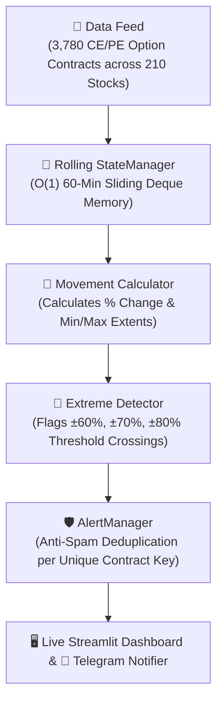

# ⚡ F&O Option Chain Extreme Movement Monitor

[](https://www.python.org/)
[](https://streamlit.io/)
[]()
[]()

A high-performance real-time **Derivatives Option Chain Scanner** designed to monitor Call (CE) and Put (PE) strike premiums across **210 active NSE F&O stocks**. The engine detects massive intraday volatility surges and crashes (**$\pm 60\%$, $\pm 70\%$, and $\pm 80\%$**) over a rolling 60-minute window and broadcasts instant, deduplicated alerts.

---

## 📸 Key Capabilities

* **210 F&O Universe**: Continuously tracks ~3,780 active At-The-Money (ATM $\pm 4$) Call and Put contracts.
* **Rolling 60-Minute Window**: Uses continuous $O(1)$ memory sliding deques (not fixed hourly clocks) to evaluate volatility.
* **Dual-Direction Alerts**: Captures explosive premium surges ($+60\%, +70\%, +80\%$) and rapid premium crashes ($-60\%, -70\%, -80\%$).
* **Anti-Spam Deduplication**: Ensures alerts trigger only once per threshold crossing, preventing repetitive alert spam.
* **Live Streamlit Dashboard**: Interactive Call/Put matrix viewfinder, live auto-streaming controller, top movers ticker, and instant Telegram bot integration.

---

## 🏗️ Architecture & Data Pipeline



---

## 📂 Project Structure

```text
StockMarket/
├── app/
│   ├── alerts/           # Alert deduplication and threshold state management
│   │   └── manager.py
│   ├── data/             # Option chain data models & streaming provider
│   │   ├── base.py
│   │   ├── dummy.py      # Multi-stock option chain simulator & anomaly generator
│   │   └── models.py     # OptionTick & MarketTick dataclasses
│   ├── detection/        # Extreme threshold detection engine (UP / DOWN)
│   │   └── detector.py
│   ├── movement/         # Percentage movement & rolling window calculators
│   │   └── calculator.py
│   ├── notifications/    # Telegram bot alert formatter and dispatch
│   │   └── telegram.py
│   ├── state/            # Rolling 60-minute in-memory time-series store
│   │   └── manager.py
│   ├── config.py         # Global threshold & window configurations
│   ├── main.py           # Streamlit Web Application Dashboard
│   └── stocks.py         # Universe of 210 active NSE F&O stocks
├── tests/                # Automated pytest test suites (53 tests)
│   ├── test_alert_manager.py
│   ├── test_detection.py
│   ├── test_dummy.py
│   ├── test_movement.py
│   ├── test_option_chain.py
│   ├── test_pipeline.py
│   ├── test_state.py
│   ├── test_stocks.py
│   └── test_telegram.py
├── .env.example          # Sample environment configuration template
├── .gitignore            # Git exclusion rules
├── requirements.txt      # Python dependencies
└── run.py                # Application launch entry point
```

---

## 🚀 Quick Start

### 1. Prerequisites
* Python 3.11 or 3.12 installed on your machine.

### 2. Clone the Repository
```bash
git clone https://github.com/your-username/fno-option-chain-monitor.git
cd fno-option-chain-monitor
```

### 3. Create & Activate Virtual Environment
```bash
# Windows
python -m venv .venv
.venv\Scripts\activate

# Linux / macOS
python3 -m venv .venv
source .venv/bin/activate
```

### 4. Install Dependencies
```bash
pip install -r requirements.txt
```

### 5. Launch the Dashboard
```bash
python run.py
```
Open your browser at **`http://localhost:8501`**.

---

## 🧪 Running Unit Tests

Run the full automated test suite with pytest:
```bash
pytest tests/ -v
```
Output:
```text
tests/test_alert_manager.py ......       [ 11%]
tests/test_detection.py .........        [ 28%]
tests/test_dummy.py ........             [ 43%]
tests/test_movement.py .........         [ 60%]
tests/test_option_chain.py ....          [ 67%]
tests/test_pipeline.py ..                [ 71%]
tests/test_state.py .........            [ 88%]
tests/test_stocks.py .....               [ 98%]
tests/test_telegram.py .                 [100%]
===================== 53 passed in 0.25s =====================
```

---

## 🔮 Future Roadmap

- [x] Multi-Stock Option Chain modeling (210 stocks, CE & PE strikes).
- [x] Rolling 60-min memory sliding window with anti-spam alert management.
- [x] Interactive Streamlit Dashboard with auto-streaming and manual spike injection.
- [ ] **DhanHQ Broker WebSocket API integration** (`DhanMarketDataProvider`).
- [ ] Historical backtesting playback mode.
- [ ] Audio chime alerts and Webhook push notifications.

---

## 📄 License
This project is licensed under the MIT License.
